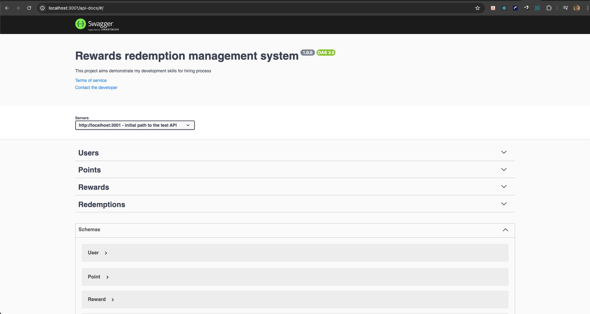

# Redeem Moderation System

This project aims to evaluate my skills as a full-stack software engineer for a hiring company process.

<p align="center">
  
</p>

# Project Goal

This part of the entire project is the backend for receiving and manipulating the data sent by the front end of the redemption system.


## Project Tech Stack

In this project, I used some rola-related tech stacks to achieve the challenge goal. Listed below:

- NodeJS;
- Typescript;
- Express;
- MySql as database;
- Swagger for API documentation;
- Docker-Compose for API and Database container orchestration;

## How to run

After make the clone of this repo and enter inside his folder, run the command: <br>
```sh
docker compose up
```
all dependencies required for the project will be installed inside the container.

OBS: Is possible the need to be created data inside the container's database for displayng in the application.

## How to test the API through Swagger

To test the application routes using Swagger just acces the route at your borwser:

```
http://localhost:3001/api-docs
```

Once loader the Swagger web interface, operations like CREATE, READ, UPDATE and DELETE can be performed using it.

I hope your team likes this project as much as I do of making. I put much effort and dedication into this project I hope you like it. Thanks for the time and attention.

## Frontend Repository url: 
- Frontend - [fontend-repo](https://github.com/thomaslnx/RedeemSystemNext)

## Stay in touch

- Author - Marcos de Moura Silva
- Github - [thomaslnx](https://github.com/thomaslnx)
- Twitter - [@thomaslnx](https://twitter.com/thomaslnx)
